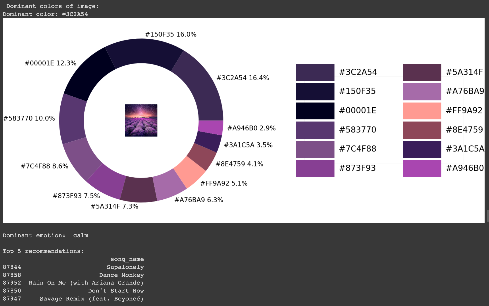
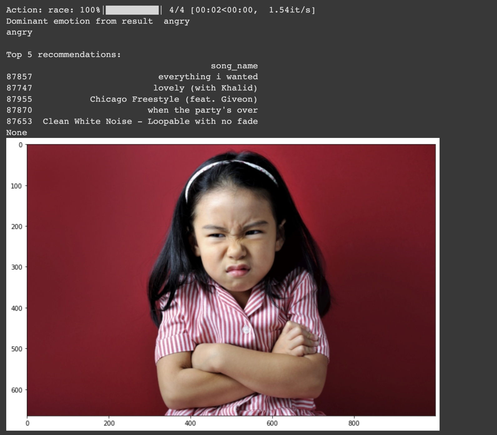

# Image Based Music Recommender System

## Instructions
1. Download the `data.csv.zip` folder and the `test_images` folder.
2. Open the colab notebook and upload the downloaded assets to the colab files.
3. Once the assets are uploaded, run all the cells.
4. Running the last cell will let you test it on your own images.
5. The last cell requires an input *face* or *noface* to determine which model to run.

## Demos

1. Landscape image demo (without face)

2. Image with face

Enjoy!
